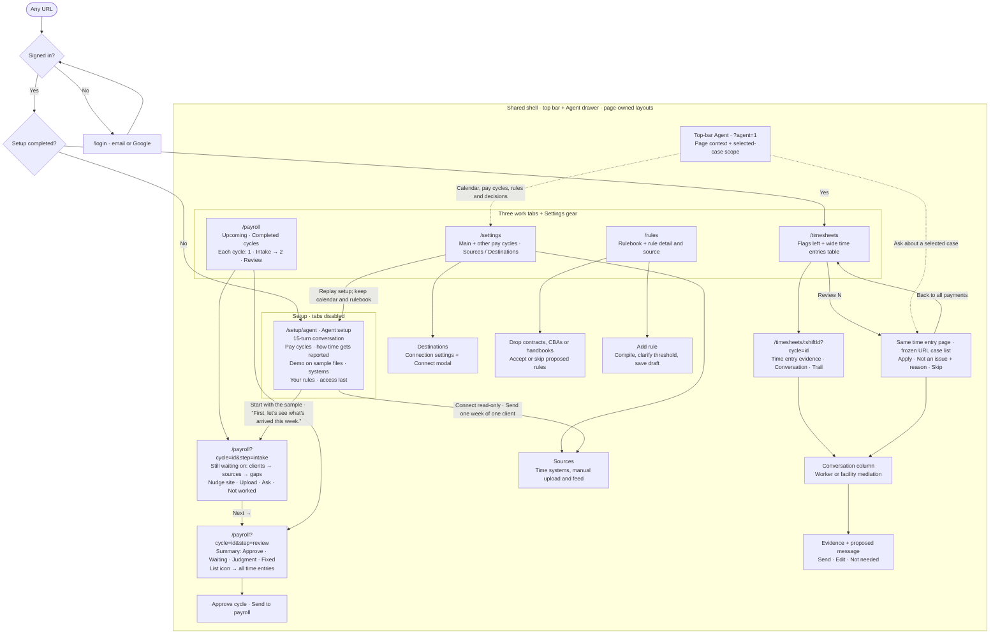

# UX flow

The flow as built. Keep this document current with changes to routes, the shell and review behavior.

## Shared shell and navigation

- All authenticated routes use AppShell for the top bar, page content, Agent panel and overlay host. Pages choose their own columns. RailLayout gives Rules a detail pane and context rail. Payroll opens a Batch rail for a selected cycle. Settings uses its right pane for connection tables and their detail, with no What we know rail. Timesheets has no auxiliary rail. The top-bar Agent button opens a 380px drawer below the bar at every width. Its `?agent=1` state survives navigation and reload; Escape and the scrim close it. Chat stays mounted when hidden.
- The word tabs are Timesheets, Payroll and Rules. A Settings gear, Agent toggle and account menu form the right cluster; there is no top-bar stats line. Setup is `/setup/agent` and disables those tabs. Finishing setup stores `forwarded: true`; setup routes then redirect to Payroll, as does `/setup/done`.
- Unfinished accounts visiting desk routes are redirected to `/setup/agent`. `/setup`, the retired form steps (`/setup/calendar`, `/setup/check`, `/setup/forward`) and legacy `/onboarding/*` also go there, `/home` goes to Timesheets and `/cycles/:id` goes to `/payroll?cycle=id`. `/reconcile` and `/reconcile/:shiftId` preserve their query and redirect to `/timesheets` and `/timesheets/:shiftId`. `/connect` goes to `/settings`, translating `tab=timesheets` to `tab=sources` and `tab=payroll` to `tab=destinations`. Unknown routes land on Timesheets.
- The agent receives the calendar, current page, selected record and relevant cycle context. Replies stream from the local Claude CLI. Validated actions can update calendar settings, add or update a pay cycle (by name, with an optional period end), add rules, navigate, or record a review decision. Chat is scoped to the selected case with a Show all option; the transcript and CLI session identifier persist locally.

## Setup

Setup is the agent conversation at `/setup/agent`. It is built for a skeptical payroll lead at a traditional staffing firm who won't share worker data with a new vendor. It follows the sales team's Discovery Intake: pay cycle and how time gets reported, then a short demo on sample files that opens with the user's own time sources, then systems of record. It asks for access last.

The page is a conversation rather than a form. It has no setup bar and no context rail: one centred column (680px, 16px gutters when narrow), a header with the stage and turn (“Pay cycle · 2 of 15”) over a thin progress line, and a composer pinned at the bottom. Each agent turn asks one thing in one short sentence, with no lead-in. Its text writes itself out word by word in under a second (instantly under reduced motion), then the answers fade in below. Picking one posts it as a right-aligned bubble, shows a typing indicator for about half a second, and brings in the next turn. Earlier turns stay readable but muted, and their controls become the answer bubble. Selecting a bubble reopens that question. Number keys pick answers and Enter continues, unless a field or popup has focus. Long intake lists show five options plus More…, and every question takes “Not sure” or Skip for now. The transcript is `aria-live="polite"`. The turn is kept in `?step=1..15`, so reload restores the transcript up to it without animating.

The fifteen turns:

1. The greeting says estimates and “not sure” are fine and no payroll data is needed.
2. Pay cycle: the pay period covering most workers, from the intake sheet's list. Weekly, bi-weekly, semi-monthly and monthly also set the main calendar's frequency; every pick moves on.
3. The main calendar read back (“weekly, weeks end Sunday, hours due Monday, payroll closes Wednesday, paid Friday. Right?”), with Change opening PayrollCalendar in a card. After Varies by client it asks “Which calendar are most of your workers on?” with PayrollCalendar already open.
4. “Any other pay cycles?” with No, just this one and Add another (Add another first after Varies by client). Add another opens PayCycleForm in a card: who's on it (a group, division or client, unique ignoring case), frequency, then pay day and period end, or pay dates for semi-monthly and monthly. Saving posts a bubble (“Clerical · Biweekly · paid Friday”) and the agent asks “Any others?” with Add another and That's all. Selecting a cycle's bubble reopens this turn with that cycle in the form, which can also Remove it. Cycles live in `cohorts`; cutoff and deadline follow the main calendar.
5. Payouts per period, as ranges or a typed number.
6. How time gets reported: “How do workers send you their time?” (the first pick is primary). A multi-select answer bubble lists the picks in order, joined with commas.
7. “How do workers clock in at the client site?”
8. “How do clients send you approved time?”
9. The demo begins. When turns 6 and 8 named a real source, it opens with one sentence from `sourcesLine()` (“You get time from texts and approved time from the VMS. Here's a sample week like that.”); otherwise “Here's a sample week ending …, from three places time usually comes from.” The sample is always Bullhorn, UKG and ADP. A checklist ticks off the three sample files for the calendar's last closed week (the Bullhorn export, Pacific Cold Storage's UKG timeclock and Lonestar Packaging's ADP timecards) with their real counts. Three file cards follow. View opens a wide popup of that CSV with tabs for all three files, the name column pinned, and the first 100 rows. It uses the shell modal, so Escape and the scrim close it, focus is trapped and returns to the card. A viewed card shows “Viewed”. Show me the magic is always available.
10. The magic: a working checklist of four steps over about three seconds (matching 2,047 workers, lining up the three sources, applying California and Texas rules, pricing every difference). Then “7 issues across 3 files · $12,100 at stake this week” and the findings split by `split()` under the default `authority` (auto-fix on, $100 per time entry, $1,000 a week). There are two the agent would fix on its own, added to the payroll deadline weekday's run and never “paid”, and five it would bring, each with its reason. Rows keep the sample's deadline order, and each opens its FindingDetail evidence in the same popup. Why did you stop on these? goes through the composer.
11. Systems of record: “Which system pays your workers?” Typed names are accepted.
12. “Which system invoices clients?”
13. “Which VMS do you use?”, where the first pick is primary.
14. Your rules. The agent names the rulebook it checked the sample against in one line (federal overtime plus California's rules, with Texas adding nothing beyond federal) and shows it as a collapsible card built from the engine's `RULES`: Federal 4, California 5, other states and cities 3, timekeeping 9, contracts and sites 6, each with its one-line sentence and citation. A note lists the catalog's 36 rule packs and the states they name. The user can add their own rules three ways, all through the Rules page's code (`src/lib/ruleIntake.ts`):
    - Drop a contract, rate card or policy: PDF, DOCX, TXT or CSV. Text files are read clause by clause by `extractClauses`; other files use the name-based `extractRules` stand-in.
    - Try a sample contract: a built-in Lonestar Packaging addendum run through the same clause extractor.
    - Type a rule in the composer. It compiles like Add rule, and a sentence without a number gets the threshold question as the agent's next line, with chips.

   A document shows a short reading checklist and then its proposals, each with scope, clause and effective date, plus Accept, Skip and Accept all. Accepted rules land in `customRules` and `rules`, so they appear on `/rules`, and the agent confirms which client they are for and when they apply. Add another and That's all for now move things along; skipping without adding any rule opens the next turn with “You can add rules any time on the Rules tab.” The per-time-entry limit and weekly cap still decide the demo's split, but the copy no longer mentions them.
15. Access, last and optional: the trust card (worker ID, hours and rates only with no SSNs; encrypted and deleted on request; SOC 2 and DPA on request; nothing sent without approval), then Connect read-only, Send one week of one client, or Start with the sample. All three store `forwarded: true`. Connect and Send open Settings, whose connector grid picks a system's read-only connection and whose inbox address takes a forwarded week. Start with the sample says one line, “First, let's see what's arrived this week.”, then opens the week awaiting review on Intake (`/payroll?cycle=id&step=intake`) without needing any data.

Answers are stored as `discovery`, with the option lists from the intake sheet in `src/lib/agentOnboarding.ts`. The composer (“Ask me anything, or answer in your own words”) answers the open question: text naming one of its answers picks it (“biweekly”, “varies”, a plain yes or no to a confirming question, “that's all”), and on multi-select questions also continues; otherwise it is the question's typed answer: a number for payouts, a system name for payroll and billing, a name not in the list for the time-source and VMS questions (it goes ahead of any chips already picked, so it is the primary the demo names, and moves on, e.g. “Bullhorn T&A and text”), or who is on another pay cycle (which opens the form with that name). Answering in the composer keeps focus there instead of moving it to the first chip; anything ending in a question mark goes to the same local agent stream as the Agent drawer, with the page's sample context. The reply appears inline, and the question's answers return after it. If the stream fails, one quiet line says so, and replies there cannot change settings.

## Work tabs and Settings

- **Timesheets:** a 320px flags queue uses `kinds()` in descending exposure order; All time entries is the default, and `?flag=ruleId` selects a flag. Search narrows the queue. The wide time entries pane keeps the cycle selector, cutoff, Review count and status filters. All time entries has worker groups and rule chips; selected flags show flat rows by absolute pay difference. A row opens `/timesheets/:shiftId?cycle=id`, carrying flag and agent context.
- **Payroll:** Every pay cycle has two steps, shown under the cycle header as `1 · Intake 6,311/6,324` → `2 · Review 29` (entries in, and the Review stat). The step lives in `?step=intake|review`; picking another cycle or period clears it so the default applies again. The default is Intake while the cycle has open gaps and its hours aren't due yet (noon on the cutoff day), and Review otherwise, including paid cycles; a `filter`, `view` or `q` param also means Review. Intake is described below. Review is the summary that follows. Each cycle's Review step opens on a summary under a header with its deadlines (payroll closes, pays): the six stats, then the agent's triage of every discrepancy into four states (`src/lib/resolution.ts`): Approve (the agent has the fix; one card per issue with the proposed action, pay impact and Approve all N, expandable to each case with a checkbox to leave it out; Review one by one opens the existing flow), Waiting on a reply (who the agent asked and when the reply is due), Needs judgment (routed to its owner, e.g. negative margin to the account manager), and Fixed (what was done to pay, by the agent or approved by you; the agent's fixes can be undone until payroll closes, which sends them back to Approve and counts them in Review). By client follows (workers, time entries, hours, gross). Picking the Review stat shows the same rows, limited to Approve, Waiting on a reply and Needs judgment, without Fixed or By client. Approving a group asks once “Approve these automatically from now on?” (Yes remembers the rule from this cycle on), and an Approve group's expanded cases end with Tell the agent what's wrong, which opens the Agent drawer with a correction prompt. Every expanded group also has Email this issue (see below). An icon at the top right switches to the full time-entry list (`?view=list`) and back; picking a stat, filtering or searching also opens the list. The week awaiting review is the setup sample's week: its records are the sample's 6,282 time entries and its discrepancies are the seven reconciliation findings, most applied by the agent (326 discrepancies, 297 resolved, 29 to review). Other weeks carry about 2,000 workers with a few percent of California entries going wrong (long days applied as daily overtime, missing meals left for review). Payments count paychecks (one per worker), and hours show as xh ym. `/payroll` lists pay cycles in a left panel filtered by Upcoming and Completed pills (`?period=`); it opens on Upcoming, which lists the cycle awaiting review (the open cycle is left out for now but still opens from a direct link); Completed lists paid cycles and opens the newest. Cycle statuses are Pending (amber), In Progress (grey), Paid and Approved. The cycle table has Start, End, Pay date, Payments, Workers, Gross, Flagged, Held, Corrections and Status columns. The one-line info bar shows Payroll, cycle status and cutoff with Approve cycle and Send to payroll actions. Selecting a cycle opens `/payroll?cycle=id`: per-worker regular hours, overtime, premiums, gross and status, with a totals footer and Batch summary. Run evidence and held-time-entry links open Timesheets. Sending records a simulated sending/sent batch and excludes held time entries; an existing batch prevents duplicate sending, and paid historical cycles cannot be resent.
- **Rules:** bucket chips and search filter engine rules, catalog packs and custom entries. The table omits Status; Live, Pack, Draft and Expiring remain in detail. Selecting a rule shows its source, citations and fired-time-entry links. Document drops create proposals to accept or skip. Add rule opens the sentence composer and draft workflow.
- **Settings:** the payroll calendar (Main pay cycle, then Other pay cycles: one line each with Edit and Remove, Add pay cycle opening the same inline form as setup, and “Everyone is on the main cycle.” when there are none), inbox address, source-system selection and payroll-connection controls sit beside the connection surface. Sources and Destinations chips switch the wiring tables; selected rows show connection detail, source feeds or manual import. ConnectModal handles vendor setup. Payroll runs and batch sends belong to Payroll. Go through onboarding again is in the page header, with the title: “Replays the setup steps. Your payroll calendar and rulebook stay as they are.” Replaying changes only `forwarded` and opens `/setup/agent`.

All data text is left aligned with tabular numerals. Supporting sections with no content are omitted, headers remain on one line, and export filenames and row numbers appear only in CSV downloads.

## Intake

Intake answers “did the expected time arrive?” before anyone reviews flags (`src/components/Intake.tsx`, logic in `src/lib/intake.ts`).

- The line on top reads “Sep 14–20 · hours due Mon 9/21 noon · 6,311 of 6,324 time entries in”. It counts scheduled time entries, not sources. While gaps are open, the due time is neutral, amber within 24 hours, and red once past.
- Next → is the primary button, right-aligned at the end of the stepper row and shown only on Intake. Its title and label read “Go to Review · 29 flags ready. You can review before everything is in.” (the second sentence only while gaps are open). The cycle header has no button on Intake.
- Still waiting on lists only clients with gaps, each headed by its name and “N of M in”, with its sources as sub-rows. A source is late against its own usual send (each connected source has a `sends` schedule in `bench/vendors.ts`: UKG nightly 4am, ADP nightly 2am, Ubeya and 7shifts nightly 3am, Paylocity nightly 5am, the emailed wall clock Sundays 11pm), not against the cutoff. A late source reads “No export since Fri 6pm. Usually arrives Sun night.” with Nudge site and Upload. Upload takes a file and counts the source's pending entries in.
- A scheduled entry no source has, after the source has sent past that day, reads “N. Alvarez · Wed 9/16 · no time entry” with evidence: “HyperTrack location shows 8h on site” (Ask supervisor) or “Scheduled, no punches” (Ask worker). Not worked opens reason chips (No-show, Shift cancelled, Other) and a text field; Other needs text. Closed gaps are stored in `acceptedGaps` (`cycleId:gapId` → reason and time), leave the count, and collect under “N closed as not worked” with Undo on each.
- Agent activity sits under a gap: asks and nudges are saved as agent notes in `threads` (`intake:cycleId:gapId`) and read “Asked Maria Castillo 2h ago · no reply”. The late wall clock also shows the sample's reminder, “Emailed the site Mon 8am · no reply”.
- Complete clients fold into “✓ N clients complete”, which opens to each client's sources and last-received times. “Late exports can be forwarded to” shows the account inbox. With no gaps, one green line reads “Everything's in”.
- The cycle list keeps each cycle's gross and pay date (“$933,350.67 · pays Fri, Sep 25”). While a cycle still has entries not in, it adds “ · 13 missing”, not counting gaps closed as not worked.
- Sample data: only the week awaiting review is still collecting. It adds four scheduled entries no source has (N. Alvarez Wed and D. Brooks Fri at Pacific Cold Storage; D. Jensen Mon and C. Jensen Thu at Lonestar Packaging) and Bayview Warehouse's wall clock, whose Friday 6pm export carried Monday to Friday for a six-person crew and whose Sunday export hasn't come. Earlier weeks arrived in full. None of this changes the sample's findings.

## Emailing an issue

Email this issue sits in the demo's evidence popup (under Suggested action) and under every expanded Payroll group. It opens an inline composer: To (one or more addresses, checked before sending), a pre-written Subject and Message (the issue, what's at stake, the suggested or proposed fix and, for a waiting group, who was asked), and the time entries attached as a CSV that can be downloaded from the attachment row. The demo's attachment has every source row side by side (worker, date, source, clock in, meal, clock out, hours, note); a Payroll group's has one row per time entry with its pay before and after the fix. Send confirms “Sent to … with <file>”, with Send to someone else. The text and CSV come from `src/lib/issueEmail.ts`.

## Review and conversation mediation

Review N opens the first undecided time entry for the selected flag (or all discrepancies). The URL records the frozen, deduplicated case IDs, so decisions and reloads preserve Case i of n. Apply names the real before-and-after amount. Not an issue requires a reason. Skip advances without deciding; skipped time entries remain reviewable. Resolutions and reasons retain their existing local format; new decisions also record a timestamp, while old decisions explicitly show that their time was not recorded.

Each `/timesheets/:shiftId` page has three independently scrolling columns: evidence and decision actions; Conversation with a pinned composer; and Trail with chronological thread events, recorded decision, and rule provenance/effective dates. Closing the modal restores the original flag and cycle. Clean time entries explain why no conversation is needed, and absent decision, source or activity sections are omitted. Rules fired-time-entry links, Payroll run-evidence and held-time-entry links, discrepancy navigation outside setup, and agent go actions use the time entry route. The old kinds review table and rail Thread tabs are removed from these flows.

Each mediation thread shows the counterparty, SMS/Email channel, evidence, proposed message, editable draft, composer, with audit events in the separate Trail column. Send, Edit and Not needed update the saved thread; an unsent composer draft survives navigation. Recorded confirmations come from engine evidence. The prototype does not invent incoming replies or claim a delivery before a local send action.

## Prototype boundaries

- Payroll rows and pay math come from the deterministic bench engine, not uploaded worker records. Settings' upload flow is simulated.
- Vendor connections, payroll batches, Thread sends and Email this issue update local browser state; they do not call vendor, SMS, email or payroll delivery services. The Thread's sent status records the local demo action.
- Document extraction and custom-rule compilation are deterministic demonstrations. Accepted and agent-created rules are stored and displayed, but custom sentences are not executed by the bench engine.
- Cognito authentication and the agent's local CLI stream are real integrations. The chat endpoint exists only in the Vite development server and requires a logged-in `claude` CLI.
- All prototype state uses localStorage `closeout-onboarding-v2`. It is not account-shared or synchronized between browsers. Other pay cycles are captured and shown, but Payroll still builds its cycles from the main calendar only. Off-cycle settlement and rules learned automatically from repeated dismissals remain unimplemented.
