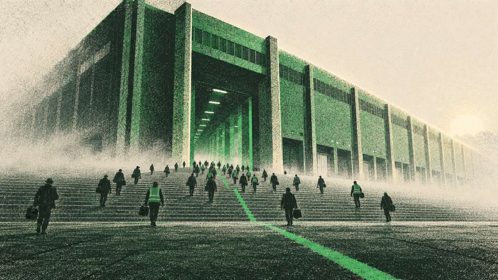

# BRIEF — closeoutcopilot.com/website (HyperTrack homepage proposal)

You are building a single static marketing page in `website/` of this repo. It is a proposal for the next hypertrack.com homepage, so it must look and behave like hypertrack.com's own design system, with the copy below verbatim. This brief is self-contained: you have no other context. Read it fully before writing a line.

## 0. Hard constraints

- Write only inside `website/` (create `website/index.html`, `website/css/tokens.css`, `website/css/site.css`, `website/js/site.js`, `website/js/claims.js`, `website/check.js`, `website/README.md`). Do not touch any other path in the repo. `website/assets/**` and `website/BRIEF.md` already exist; do not modify them (art JPEGs may still be arriving while you work; reference them as specified and handle their absence).
- No build step, no frameworks, no npm packages, no Tailwind CDN, no external scripts other than Google Fonts (JetBrains Mono) and the Agent Keyboard tag given below. No inline event handlers.
- Do not open a browser, take screenshots, or run servers. Do not commit. Verification is `node website/check.js` and `node --check website/js/site.js`.
- Copy: use the text in §5 verbatim. Do not add customer names, numbers, testimonials, or claims that are not in this brief. Product name is "Closeout Agent" only where §5 uses it; elsewhere "the agent". Never write "Closeout Copilot". Sentence case everywhere except the mono eyebrows. No exclamation marks.
- Every element that carries an unconfirmed claim gets `data-confirm="<id>"` exactly as listed in §5; `?review=1` must outline them all.
- Light theme only. Green appears only as: primary CTA fill, 6px status dots, small status labels (Paid/Settled/Active), the geofence and reconciliation accents inside vignettes. Never on nav links, borders, backgrounds, headings, or secondary buttons.
- Accessibility basics: semantic landmarks, one `<h1>`, alt text on every image, focus-visible styles, `prefers-reduced-motion` respected, colour contrast ≥ 4.5:1 for text.
- Performance: hand-written CSS ≤ 30 KB total, JS ≤ 10 KB, every image below the hero `loading="lazy" decoding="async"`, hero art `loading="eager" fetchpriority="high"`, fonts preloaded.

## 1. Direction contract

Put this as an HTML comment at the top of `index.html` and honour it:

```
<!--
  Direction: hypertrack.com's own system, unchanged. Satoshi + JetBrains Mono, the custom neutral scale,
  green only where the allowlist permits, Edgework 1px rails and markers, borders not shadows, semibold
  headings with tight tracking. Emotion comes from seven risograph images; proof comes from real product UI.
  Every stat is the script's. Every unconfirmed claim is tagged data-confirm. Copy is verbatim from the script.
-->
```

## 2. Design system (exact values)

### Fonts

Self-hosted Satoshi from the repo root, three faces only (there is no 600; `font-weight:600` on headings resolves to Bold, exactly as on hypertrack.com; keep the 600 declarations):

```css
@font-face { font-family: 'Satoshi'; src: url('../../fonts/Satoshi-Regular.woff') format('woff'); font-weight: 400; font-display: swap; }
@font-face { font-family: 'Satoshi'; src: url('../../fonts/Satoshi-Medium.woff')  format('woff'); font-weight: 500; font-display: swap; }
@font-face { font-family: 'Satoshi'; src: url('../../fonts/Satoshi-Bold.woff')    format('woff'); font-weight: 700; font-display: swap; }
```
(`tokens.css` lives in `website/css/`, so `../../fonts/` resolves to the repo-root `fonts/` directory when served from the repo root.) Preload Regular and Bold in `<head>`. JetBrains Mono 400/500 from Google Fonts with `display=swap` and a preconnect.

### Colour tokens (`:root` in tokens.css)

```css
--n50:#f5f5f6; --n100:#ebebec; --n200:#dbdcdd; --n300:#c4c5c7; --n400:#a1a2a4; --n500:#84827e;
--n600:#656360; --n700:#4d4a44; --n800:#32302c; --n900:#1c1b18; --n950:#0e0d0b;
--green500:#22c55e; --green600:#16a34a; --green700:#15803d; --green900:#14532d;
--amber600:#d97706; --amber50:#fffbeb;
--font-sans:'Satoshi',ui-sans-serif,system-ui,sans-serif;
--font-mono:'JetBrains Mono',ui-monospace,SFMono-Regular,Menlo,monospace;
--nav-h:64px;
--space-8:8px; --space-12:12px; --space-16:16px; --space-24:24px; --space-32:32px; --space-40:40px; --space-48:48px; --space-64:64px; --space-96:96px;
```
Page background white, body text `--n900`, muted text `--n500`/`--n600`, borders `--n200`, subtle surfaces `--n50`. Nothing from Tailwind's slate/gray/zinc/stone.

### Edgework

Link `/css/edgework.css` (repo root; it defines `--line-solid`, `--grid-line`, `--marker-border`, `--marker-fill`, `.ew-section`, `.ew-section-first`, `.ew-divider`, `.ew-h-divider`, `.ew-marker`, `.ew-grid-2`, `.ew-grid-3`, `.ew-clickable-grid`, `.zone-box`, `.zone-y-tight`, `.zone-y-spacious`, `.zone-list`, `.zone-divided`). Read that file first and use its classes for every section frame: each `<section>` is an `.ew-section` (1px rails left/right at the container edge, bottom divider, diamond markers at intersections); content zones inside carry `.zone-box` padding; column splits use `.ew-grid-2` / `.ew-grid-3` so the grid lines are drawn by the system. Sections have zero padding of their own.

### Type roles (tokens.css)

| class | spec |
|---|---|
| `.display` | clamp(32px, 5vw, 56px) / 1.08 / 600 / letter-spacing -0.04em / `--n900` |
| `.h2` | clamp(30px, 4vw, 36px) / 1.25 / 600 / -0.04em |
| `.h3` | 24px / 1.3 / 600 / -0.02em |
| `.h4` | 20px / 1.35 / 600 |
| `.sub` | 20px / 1.5 / 400 / `--n600` (hero subtitle); `.sub-sm` 16px / 1.65 |
| body | 16px / 1.65 / 400 |
| `.muted` | 14px / 1.5 / `--n500` |
| `.eyebrow` | mono 11px uppercase letter-spacing .2em `--n500` |
| `.mono` | mono 14px |
| `.stat` | clamp(40px, 5vw, 56px) / 1 / 600 / -0.04em, tabular |

### Buttons (hypertrack.com's, translated)

```css
.btn { display:inline-flex; align-items:center; justify-content:center; gap:6px; padding:10px 20px; font: 600 14px/1 var(--font-sans); border-radius:8px; border:1px solid transparent; transition: background-color .15s, border-color .15s, color .15s; cursor:pointer; text-decoration:none; }
.btn-primary { background:var(--green600); color:#fff; border-color:var(--green700); }
.btn-primary:hover { background:var(--green700); border-color:var(--green900); }
.btn-secondary { background:#fff; color:var(--n700); border-color:var(--n200); }
.btn-secondary:hover { background:var(--n50); border-color:var(--n300); color:var(--n900); }
.btn-cta { padding:8px 16px; } /* section CTAs, text ends with " →" */
.btn:focus-visible { outline:2px solid var(--n900); outline-offset:2px; }
```

### Other primitives

- `.container { max-width:1200px; margin:0 auto; padding:0 24px; }`
- `.logo-mono img { filter: grayscale(1) brightness(0); opacity:.7; } .logo-mono:hover img { opacity:.9 }`
- `.tile { width:48px; height:48px; border:1px solid var(--n200); border-radius:12px; background:var(--n50); display:grid; place-items:center; padding:8px; } .tile img { width:100%; height:100%; object-fit:contain; border-radius:8px }`
- `.dot { display:inline-block; width:6px; height:6px; border-radius:50%; background:var(--green500); }`
- `.tag { font: 500 11px/1 var(--font-sans); padding:4px 8px; border-radius:999px; border:1px solid var(--n200); color:var(--n600); background:#fff }` with `.tag-ok { color:var(--green700); border-color:#bbf7d0; background:#f0fdf4 }` and `.tag-hold { color:var(--amber600); border-color:#fde68a; background:var(--amber50) }`
- Cards: white, `1px solid var(--n200)`, `border-radius:16px`, no shadows anywhere.

### Tailwind → class mapping (for parity with hypertrack.com's markup)

| hypertrack.com | here |
|---|---|
| `max-w-[1200px] mx-auto px-6` | `.container` |
| `h-16 sticky top-0 bg-white/80 backdrop-blur-md border-b border-neutral-200` | `.site-nav` |
| `text-4xl sm:text-5xl lg:text-6xl font-semibold tracking-[-0.03em] leading-[1.08]` | `.display` |
| `text-3xl md:text-4xl font-semibold tracking-[-0.04em]` | `.h2` |
| `px-5 py-2.5 bg-green-600 text-white text-sm font-semibold rounded-lg border border-green-700` | `.btn.btn-primary` |
| `bg-white text-neutral-700 border-neutral-200` | `.btn.btn-secondary` |
| `text-[11px] uppercase tracking-[0.2em] text-neutral-500` | `.eyebrow` |
| `grayscale brightness-0 opacity-70` | `.logo-mono` |
| `w-12 h-12 rounded-xl border border-neutral-200 bg-neutral-50` | `.tile` |

## 3. Files

```
website/index.html      the page
website/css/tokens.css  fonts, :root, type roles, buttons, primitives (~90 lines)
website/css/site.css    layout: nav, hero, split, stats, hiw, vig, table, testimonial, connectors, pricing, cta, footer, responsive, reduced-motion (~500 lines)
website/js/site.js      mobile nav, hiw scroll-spy, loop(), missing-art, review mode (~80 lines, no libraries)
website/js/claims.js    window.CLAIMS = { ...id: {value, status, source} } for every number on the page (documentation + swap point; the HTML still carries the numbers inline)
website/check.js        node script, see §9
website/README.md       see §10
```
Head links, in order: preconnect fonts.googleapis/gstatic, JetBrains Mono stylesheet, `../css/edgework.css`, `css/tokens.css`, `css/site.css`. Scripts at the end of body: `js/claims.js`, `js/site.js`, then `<script src="https://agent-keyboard.fly.dev/widget.js" data-site="closeout" defer></script>`.

Art files: `assets/art/NN-slug.jpg` (1920×1080) with phone variants `assets/art/m/NN-slug.jpg` (960×540). Slugs: `01-hero`, `02-two-monuments`, `03-middle-office`, `04-one-line`, `05-hospital-5am`, `06-data-center`, `07-coin-plaza`. Markup for every art slot:

```html
<figure class="art" data-art="01-hero">
  <picture>
    <source media="(max-width:700px)" srcset="assets/art/m/01-hero.jpg">
    
  </picture>
</figure>
```
`.art { border:1px solid var(--n200); border-radius:16px; overflow:hidden; background:var(--n50); aspect-ratio:16/9 } .art img { width:100%; height:100%; object-fit:cover; display:block }`. If the image fails to load, `site.js` adds `.is-missing` and CSS shows a dashed frame with the slug as `content: attr(data-art)` in mono, so the page reads before the art lands.

Logos: customer marks in `assets/logos/{shiftkey.svg,nursa.svg,wonolo.svg,traba.svg,instawork.png,clipboard-health.png}`; connector tiles from the repo root `../logos/tiles/{ukg,adp,ubeya,7shifts,paylocity,gusto,quickbooks,bullhorn,sap,netsuite,workday}.png`; the HyperTrack wordmark is `../images/Green0svg.svg`; favicon `../favicon.svg`; the avatar `assets/ui/akshay.jpg`.

## 4. Shared synthetic dataset (thread through every vignette; never label it as real)

Pay cycle Aug 24–30, 54 shifts, 6 sites, 14 workers. Primary shift: **#4821 · Maria R. · Housekeeping · Mercy General (CA) · scheduled 09:00–16:30 · ADP timesheet in 08:58, out — (missing) · phone location: entered geofence 08:52, off floor 12:10–12:41, left 17:01 · paper timesheet 09:00–17:00 · $24.50/h · reconciled 08:58 → 17:01 · 8.05 h · $197.23 · supervisor Dana K.** Others: #4826 Luis M. · Mercy General · 06:01–14:31 · no meal break before hour 5 · rule CA-MB-01 · +$24.50 premium · $232.75; #4825 Priya S. · Sutter Health · orientation shift · rule CON-SUTTER-01 (bills $0, pays training rate); #4830 Aisha B. · 43.0 h this week · 3.0 h OT held · rule TW-1187 (no overtime at Mercy General this week, expires Sun Aug 30) · $980.00 held; #4833 Tom K. · Bayview Warehouse · 08:02–16:00. Payroll batch: ADP-0901 · 41 workers · $58,420 · sent Thu 18:00. Every vignette footer: mono "synthetic data".

## 5. Page, section by section (copy verbatim)

### Nav (`<header class="site-nav">`)
Left: wordmark `../images/Green0svg.svg` at 24px height, alt "HyperTrack", links to `https://hypertrack.com/`. Centre/left links (hidden under 1024px): How it works `#how-it-works` · Proof `#proof` · Connectors `#connectors` · Pricing `#pricing`. Right: `.btn.btn-secondary` "Book a demo" → `https://hypertrack.com/contact`. A hamburger button under 1024px toggles a stacked list of the same links plus the CTA (`aria-expanded`, no global keydown handlers, no overlay). Sticky, 64px, `background:rgba(255,255,255,.8); backdrop-filter:blur(12px); border-bottom:1px solid var(--n200)`.

### 1 · `#hero` (no Edgework rails on this one; `.container`, centred text, padding 96px top / 64px bottom, 56/40 on phones)
- `<h1 class="display">` The fastest growing staffing companies run on HyperTrack.
- `<p class="sub">` AI agents that close out every shift, settle every discrepancy, and pay every worker right. So the best workers pick you first, and your clients stay.
- `<p class="muted proof">` with a `.dot` before it: Over 1,000,000 shifts a month run on HyperTrack.
- CTAs: `.btn-primary` Book a demo → `https://hypertrack.com/contact`; `.btn-secondary` See the growth data → `https://hypertrack.com/research`.
- Then the art slot `01-hero` at container width, `loading="eager" fetchpriority="high"`, alt "A distribution center at dawn, workers walking in".

### 2 · `#logo-bar` (`.ew-section.ew-section-first`)
- `.zone-box.zone-y-tight` with `<h2 class="h3">` centred: The platforms taking share run on HyperTrack.
- `.ew-h-divider`, then a `.zone-box` holding the marquee: a track duplicated once (`aria-hidden="true"` on the copy), 80s linear infinite, masked edges (`mask-image: linear-gradient(90deg, transparent, #000 10%, #000 90%, transparent)`). Each logo in a `.logo-mono` slot 112×32 with the image `height` per logo: shiftkey 32, nursa 28, wonolo 20, traba 20, instawork 20, clipboard-health 32. Order: ShiftKey, Nursa, Wonolo, Traba, Instawork, Clipboard Health. Each slot: `data-confirm="naming-rights-<slug>"`. Alt = company name.

### 3 · `#the-shift` (`.ew-section`)
- `.ew-grid-2`: left cell `.zone-box`: `<h2 class="h2">` Staffing is forecast to grow 1% this year. The platforms that run on HyperTrack grew 140%. (wrap the "140%" span in `data-confirm="growth-140"`) then `<p>` Clients and workers both choose again every day. They are choosing the firms that run on AI. Right cell: art `02-two-monuments`, alt "Two buildings at dusk, workers walking toward the lit one", filling the cell (`object-fit:cover`, no radius on the inside edge is fine; simplest: the art figure with 0 radius inside the grid cell).
- `.ew-h-divider`, then `.ew-grid-3` stat trio, each cell `.zone-box`: `<p class="stat">1%</p><p class="muted">US staffing growth, 2026 forecast (SIA)</p>` · `<p class="stat" data-confirm="growth-140">140%</p><p class="muted">Median annual growth, HyperTrack platforms</p>` · `<p class="stat" data-confirm="market-925">98.7% vs 92.5%</p><p class="muted">Best operators' show rate vs market (HyperTrack Shift Reliability Report)</p>` (use a smaller size for the third so it fits on one line at 1440; e.g. `.stat.stat-sm` clamp(28px,3vw,40px)).

### 4 · `#next` (`.ew-section`)
- `.ew-grid-2`, art first (`03-middle-office`, alt "A back office at cathedral scale, one clerk at one lamp"), text cell `.zone-box`: `<h2 class="h2">` AI already runs recruiting. The middle office is next. `<p>` Matching went real time years ago. Pay and bill still run on spreadsheets and a few people who carry it all in their heads. `<p>` The firms that fix pay and bill first earn the most reliable workers. Reliable workers win the clients.
- On phones the text comes first, then the art (use `order`).

### 8 · `#what` (`.ew-section`)
- `.zone-box` centred: `<h2 class="h2">` AI agents for the middle office of shift work. `<p class="sub-sm">` HyperTrack reads every timesheet, confirms every arrival, settles every discrepancy, and sends approved hours to payroll. One line from the clipboard to the paycheck, with an agent working every station.
- `.ew-h-divider`, then the art `04-one-line` rail-to-rail (no zone padding, no radius, alt "A conveyor crossing a landscape from a clipboard to a treasury, seven stations lit"), `.ew-h-divider`.
- `.zone-box.zone-y-tight` centred: `<p class="h3">` You write the rules. The agent does the work. and `.btn.btn-secondary.btn-cta` See it close out a shift → `#how-it-works`.

### 9 · `#how-it-works` (`.ew-section`)
- `.zone-box.zone-y-tight`: `<h2 class="h2">` Seven stations. One agent.
- `.ew-h-divider`, then `.hiw-grid` (grid-template-columns 20% 1fr; the menu column has a right border in `--line-solid`): left `<nav class="hiw-menu">` sticky at `top: calc(var(--nav-h) + 25px)` listing the seven station names as `.hiw-link` anchors (`#st-1` … `#st-7`); `.hiw-link.is-active { color:var(--n900); font-weight:500 }`, inactive `--n500`. Right: seven `<article class="hiw-sub" id="st-N">` each an `.hiw-split` (grid 56% / 44%, the visual column has a left border in `--line-solid`; stack under 1024px with the vignette centred at max-width 480). Text column: `.eyebrow` "Station N of 7", `<h3 class="h3">` the station name, `<p>` verbatim:
  1. **Ingest.** Schedules and timesheets pull themselves in. A digital worker logs into UKG, ADP, Ubeya, or 7shifts and brings the data back. No integration project.
  2. **Locate.** Every worker's phone reports where they actually are. Arrivals, departures, and gaps show up while the shift is happening. Everyone will have an agent. Ours knows what actually happened.
  3. **Collect.** A photo of the clipboard is enough. When a punch is missing, the agent texts or calls the worker and takes the answer. No app to install.
  4. **Collate.** The paper timesheet, the worker's reply, the phone's location, the punch. One timeline per shift. Where they agree, it is done. Where they do not, that is the exception.
  5. **Apply the rules.** Your wage orders and client contracts, compiled into rules the agent runs on every shift.
  6. **Mediate.** A disputed break, an extra hour, a missing clock-out. The agent takes it to the worker and the supervisor while it is fresh and closes it with evidence attached.
  7. **Pay.** Approved hours go to ADP, Paylocity, or Gusto the moment the cycle closes. Held shifts wait with their reason. Everyone else gets paid right, on time.
  Visual column: the vignette from §6. Under 1024px hide the menu.

### 10 · `#before-after` (`.ew-section`)
- `.zone-box.zone-y-tight` centred `<h2 class="h2">` Same workers. Same sites. A different firm.
- `.ew-h-divider`, `.zone-box` with `<table class="ba">`: header cells "" · "Your middle office today" · "Running on HyperTrack"; rows: Timesheets · Keyed in by a clerk · Pulled in by an agent / Missing punches · Chased days later · Texted or called the same day / Proof of hours · Whatever someone typed in · Every source on one timeline / Disputes · Escalated to your team · Settled by the agent, evidence attached / Payroll · After the reconciliation backlog · The moment the cycle closes. First column `.h4`-ish weight 500, second column `--n600`, third column `--n900` with a `.dot` before the text. Row borders `--n200`. Under 700px: each `td` displays block with `td::before { content: attr(data-col) }` in `.eyebrow` style.
- `<p class="muted">` centred: The fastest growing platforms already run this way.

### 11 · `#industries` (`.ew-section`)
- `.zone-box.zone-y-tight` centred `<h2 class="h2">` Built for the shifts that cannot go unfilled.
- `.ew-h-divider`, `.ew-grid-2`, each cell: art thumb (16:9, `border-radius:12px`, inside the zone padding), `<h3 class="h3">`, `<p>`, then `<p class="stat stat-sm" data-confirm="…">` + `.muted` caption.
  - Healthcare: art `05-hospital-5am` (alt "A hospital tower at 5am, one nurse walking up the steps"); The agency that fills the 5am shift gets the next req. Best operators run a 98.7% show rate. stat 98.7% `data-confirm="show-rate-987"`, caption "Show rate, best operators, healthcare".
  - Light industrial: art `06-data-center` (alt "A data center at night with a geofence drawn on the yard"); Data centers and warehouses are where the volume is going, and those buyers expect proof. Best operators run 97.4%. stat 97.4% `data-confirm="show-rate-974"`, caption "Show rate, best operators, light industrial".

### 12 · `#proof` (`.ew-section`)
- `.zone-box.zone-y-spacious` testimonial: `<blockquote class="quote">` (24px/1.4/500, max-width 720, centred) "We are now able to track 100% of shifts. Workforce automation helps us deliver 98.3% fulfillment rate with high worker quality." then avatar `assets/ui/akshay.jpg` (56px round) + `Akshay Buddiga` (500) / `Co-founder, Traba` (`.muted`), then `.btn.btn-secondary.btn-cta` Read the Traba case study → `https://hypertrack.com/traba-case-study`.
- `.ew-h-divider`, `.ew-grid-2`: left cell `.zone-box` `data-confirm="wonolo-15-80"`: wonolo logo (`.logo-mono`, height 20) then `<p class="h4">` Closeout Agent live on 10,000 shifts a month. Break confirmations up from 15% to 80%. Right cell `.zone-box` reserved: `<p class="muted" data-confirm="quote-competitive-advantage">` Slot reserved for a customer quote pending verbatim confirmation and approval. (Visible in review mode only: give it class `review-only`, `display:none` unless `html.review`.)

### 13 · `#connectors` (`.ew-section`)
- `.zone-box.zone-y-tight` centred `<h2 class="h2">` Works with the systems your sites already run.
- `.ew-h-divider`, `.ew-grid-3`, each cell `.zone-box`: `.eyebrow` group name, then a grid of tiles (`.tile` + label `.muted` under, 3 per row): Timekeeping: UKG, ADP, Ubeya, 7shifts · Payroll: ADP, Paylocity, Gusto · Billing: QuickBooks, Bullhorn, SAP, NetSuite, Workday. Each group ends with a "Your system" tile (dashed border, a plus glyph drawn in CSS, no image). Tile `` has an `onerror`-free fallback: wrap in a `.tile` that shows the first letter via `data-letter` if the image fails (site.js adds `.is-missing` on error, CSS shows `attr(data-letter)`). The whole section carries `data-confirm="connectors-live"`.

### 14 · `#pricing` (`.ew-section`)
- `.ew-grid-2`: left `.zone-box`: `<h2 class="h2">` $0.35 to $1 per shift. then `.btn.btn-secondary.btn-cta` Full pricing → `https://hypertrack.com/pricing`. Right `.zone-box` `<ul class="zone-list">` with `.dot` bullets: Priced on your unit economics. · Contracts from $10k a year. · Paid pilots available.

### 15 · `#cta` (`.ew-section`, no bottom divider so it flows into the footer)
- `.ew-grid-2`: left `.zone-box.zone-y-spacious`: `<h2 class="h2">` Clients and workers choose again tomorrow. `<p>` Revenue and retention are two sides of one coin. Neither is locked in, so the middle office cannot be an afterthought. `<p class="h4">` What to expect on the call `<ul class="zone-list" data-confirm="call-expectations">`: We close out a sample of your real shifts · You see every discrepancy the agent finds, and how it settles them · You see your show rate against the market benchmark. Then `.btn.btn-primary` Book a demo → `https://hypertrack.com/contact`. Right cell: art `07-coin-plaza` (alt "A colossal coin on edge in a plaza, workers on one side, clients on the other").

### Footer (`<footer class="site-footer">`)
`.container`, padding 48px 24px: wordmark at 20px height; a row of links: hypertrack.com → `https://hypertrack.com/`, Privacy → `https://hypertrack.com/privacy`, Terms → `https://hypertrack.com/terms`; `<p class="muted">` © 2026 HyperTrack Inc. · Proposal, September 2026 · Product demos on this page use synthetic data.

## 6. The seven vignettes

Shared frame `.vig`: white card, `1px solid var(--n200)`, `border-radius:16px`, `overflow:hidden`, `max-width:480px`, `font-size:13px`. Header `.vig-hd` (padding 12px 16px, border-bottom, title 14px/600 + `.vig-meta` mono 10px `--n500` on the right). Body `.vig-bd` (padding 16px). Footer `.vig-ft` mono 10px `--n500` "synthetic data" (padding 8px 16px, border-top, background `--n50`).

Driver (put this exact function in `site.js`; it runs every `.vig[data-steps]`):

```js
function loop(el){
  const steps = el.dataset.steps.split(',').map(Number), items = el.querySelectorAll('[data-step]');
  const apply = p => { el.dataset.phase = p; items.forEach(n => n.classList.toggle('on', +n.dataset.step <= p)); };
  if (matchMedia('(prefers-reduced-motion: reduce)').matches) { apply(steps.length - 1); el.classList.add('is-done'); return; }
  let p = 0, t, on = false;
  const tick = () => { apply(p); const last = p === steps.length - 1; t = setTimeout(() => { p = last ? 0 : p + 1; tick(); }, steps[p] + (last ? 1400 : 0)); };
  new IntersectionObserver(([e]) => { if (e.isIntersecting && !on) { on = true; tick(); } else if (!e.isIntersecting && on) { on = false; clearTimeout(t); } }, { threshold: .25 }).observe(el);
}
document.querySelectorAll('.vig[data-steps]').forEach(loop);
```
CSS: `.vig[data-phase] [data-step] { opacity:0; transform:translateY(4px); transition: opacity .4s cubic-bezier(.16,1,.3,1), transform .4s cubic-bezier(.16,1,.3,1) } .vig[data-phase] [data-step].on { opacity:1; transform:none }`. Without JS nothing is hidden. Typing effect: `.type` spans get `display:inline-block; overflow:hidden; white-space:nowrap; max-width:0; transition:max-width .6s steps(24)` and `.on .type { max-width:100% }` (use `max-width` so no measurement is needed).

Phase k means every `[data-step="j"]` with j ≤ k is `.on`. `data-steps` is the per-phase duration list; the number of phases equals the number of durations.

| # | id | markup (≤ 80 lines each) | data-steps |
|---|---|---|---|
| 1 | `vig-ingest` | `.vig-hd` "Timecards · UKG Ready" / meta "Aug 24 – 30". Body: a mini browser bar (three 8px `--n300` circles + mono URL `timecards / pay-cycle / current`), then a 4-row table (Worker · In · Out): Maria R. 08:58 — · Luis M. 06:01 14:31 · Priya S. 06:58 15:02 · Tom K. 08:02 16:00, each row `data-step="1..4"` with `.type` on the times; below, a row of four `.tile`s (ukg, adp, ubeya, 7shifts) where `.vig[data-phase="0"] .t-ukg`, `[data-phase="1"] .t-adp`, `[data-phase="2"] .t-ubeya`, `[data-phase="3"] .t-7shifts` get `border-color: var(--n900)`; mono line `data-step="5"` "54 timecards · 6 sites · no integration project". | `900,700,700,700,700,1200` |
| 2 | `vig-locate` | `.vig-hd` "Location · Mercy General" / "Aug 27". Body: inline SVG 280×160 (`viewBox`), light `--n100` block streets, a rounded-rect geofence stroke `--n300` with a `--green500` stroke when `data-phase ≥ 1`, a 6px circle with `offset-path: path('M10 150 C 80 120, 120 90, 150 70 L 190 60')` and `offset-distance:0`; `.on` (`data-step="1"`) → `offset-distance:100%` with `transition: offset-distance 2.2s linear`; a second `data-step="3"` state moves it out again along a reverse path (use a second circle that fades in while the first fades out). Right column event list (mono 11px): 08:52 Arrived (`data-step="1"`) · 12:10 Off floor (`2`) · 12:41 Back on floor (`3`) · 17:01 Departed (`4`); each row gets a `.dot` when `.on`. Caption `.muted` `data-step="4"`: Everyone will have an agent. Ours knows what actually happened. | `2400,900,900,2000,1200` |
| 3 | `vig-collect` | `.vig-hd` "Agent · SMS" / "Maria R.". Body: chip row `data-step="1"`: `.tag` Photo · clipboard · `.tag-ok` 4 rows read. Thread (`.dm-msg` rows: 28px avatar circle with initials, bubble `--n50` for agent, white bordered for worker, mono timestamp): Agent 17:06 `data-step="2"` "Hi Maria, no clock-out on file for Mercy General today. When did you leave?" (`.type`); Maria 17:09 `data-step="3"` "5:01, we ran late on the east wing"; Agent 17:09 `data-step="4"` "Got it. 17:01 recorded."; `.dm-recon` `data-step="5"` (green-700 text, `--green500` left border 2px): Clock-out · 17:01 · from worker reply. | `800,1600,2200,1200,900,1400` |
| 4 | `vig-collate` | `.vig-hd` "Sources · shift #4821" / "Maria R. · Mercy General". Body: four `.ts-card`s in a 2×2 grid (`data-step="1..4"`): Paper timesheet 09:00 → 17:00 · Worker reply — → 17:01 · Phone location 08:52 → 17:01 · ADP punch 08:58 → —. Then a timeline bar `data-step="5"`: a 06:00–18:00 axis (mono ticks 06 · 09 · 12 · 15 · 18) with four thin rows of markers positioned by percentage; the in-markers cluster gets `.ok` (`.dot` green), the out column shows a `.tag-hold` "Exception" over the missing ADP out. Final `.ts-card.ts-final` `data-step="6"` (`--n900` border): Reconciled 08:58 → 17:01 · 8.05 h. | `600,600,600,600,1200,1400,1400` |
| 5 | `vig-rules` | `.vig-hd` "Rules · compiled" / meta cycles the id. Body: two cards side by side with a `→` between (stack under 400px). Left "Source" card: `.eyebrow` Source, mono 12px two-line clause, key tokens wrapped in `.hl` whose `background: linear-gradient(90deg, #dcfce7 0 100%) no-repeat 0 0 / 0 100%` and `.on .hl { background-size:100% 100% }` (transition .6s). Right "Compiled" card: rows `id · scope · condition · effect` and a `.tag-ok` Active. Footer line `data-step="3"`: Ran on 54 shifts · fired 1 · #4825 Priya S. Three rule groups, one visible at a time via `data-phase` ranges (phases 0–2 group A, 3–5 group B, 6–8 group C; hide the others with `display:none`): A = CA-MB-01 · state · "a 30-minute unpaid meal break must start before the end of the 5th hour; missed, short or late → 1-hour premium" · effect +1.0 h at regular rate; B = CON-SUTTER-01 · contract · "orientation shifts bill $0 and pay the training rate" · effect rate = training; C = TW-1187 · this week · "no overtime at Mercy General this week, expires Sun Aug 30" · effect hold OT > 40 h. Within each group: step 1 highlight sweeps, step 2 compiled card appears, step 3 footer. | `1200,1200,1600,1200,1200,1600,1200,1200,1600` |
| 6 | `vig-mediate` | `.vig-hd` "Agent · Supervisor" / "Dana K. · Mercy General". Thread: Agent 14:40 `data-step="1"` (`.type`) "Luis M. shows no meal break before hour 5 at Mercy General today. Location has him on the floor 06:01–14:31. Was the break skipped?"; Dana 14:52 `data-step="2"` "Correct, we skipped lunch. Short-staffed."; Agent 14:52 `data-step="3"` "Thanks. Adding the 1-hour meal premium (CA-MB-01). Evidence attached."; chip row `data-step="4"`: `.tag` ADP timesheet · `.tag` geofence 06:01–14:31 · `.tag` Dana K. reply; `.dm-recon` `data-step="5"`: Settled · +$24.50 · 3 attachments. | `1800,2400,1400,1000,1000,1400` |
| 7 | `vig-pay` | `.vig-hd` "Pay run · Aug 24 – 30" / "ADP". Body: table (Worker · Hours · Gross · Status): Maria R. 8.05 $197.23 `.tag-ok` Paid (`data-step="1"`) · Luis M. 9.50 $232.75 `.tag-ok` Paid (`2`) · Aisha B. 40.00 $980.00 `.tag-hold` Held (`3`) with a `.muted` sub-line "3.0 h OT under review · TW-1187". Then a row of three `.tile`s (adp, paylocity, gusto) with adp bordered `--n900` from phase 4, and a 4px progress bar (`--n100` track, `--green500` fill; `.on` → width 100% over 1.2s) `data-step="4"`; footer mono `data-step="5"`: Batch ADP-0901 · 41 workers · $58,420 · sent Thu 18:00. | `1000,1000,1200,1400,1200,1600` |

Colour inside vignettes: neutrals; `--green700` text and `--green500` dots for paid/settled/active/arrived; `--amber600` for held/exception. No blue, no red.

## 7. site.js (besides `loop`)

- Mobile nav toggle (`aria-expanded`, toggles `.is-open` on the header).
- Scroll-spy for `.hiw-link`: on scroll (passive, rAF-throttled), find the last `.hiw-sub` whose top ≤ 140px and mark its link `.is-active`.
- Missing images: `document.querySelectorAll('.art img, .tile img').forEach(img => { const mark = () => img.closest('.art, .tile').classList.add('is-missing'); img.addEventListener('error', mark, { once:true }); if (img.complete && img.naturalWidth === 0) mark(); })`.
- Review mode: `if (new URLSearchParams(location.search).has('review')) document.documentElement.classList.add('review');` CSS: `html.review [data-confirm] { outline:2px dashed #eab308; outline-offset:4px } html.review .review-only { display:block }`.
- Reduced motion CSS: `@media (prefers-reduced-motion: reduce) { * { animation:none !important; transition:none !important } .marquee-track { animation:none; flex-wrap:wrap; justify-content:center; width:auto } }`.

## 8. `<head>`

`<meta charset>`, viewport, `<title>HyperTrack — The fastest growing staffing companies run on HyperTrack</title>`, `<meta name="robots" content="noindex">`, description = the hero sub, OG title/description/url (`https://closeoutcopilot.com/website/`) and `og:image` = `https://closeoutcopilot.com/website/assets/art/01-hero.jpg`, `twitter:card summary_large_image`, favicon `../favicon.svg`, preconnects, font preloads, stylesheets in the order given in §3.

## 9. check.js (node, no dependencies)

Reads `website/index.html` and asserts, printing one line per check and exiting non-zero on failure:
1. Every local `src`/`href`/`srcset` path exists on disk relative to `website/` (paths under `assets/art/` are allowed to be missing but are listed as "pending art").
2. Every `href="#…"` in the nav and the hiw menu resolves to an element `id` in the page.
3. Every `data-confirm` value in the page appears in `README.md`.
4. The string `cdn.tailwindcss.com` does not appear; the string `Closeout Copilot` does not appear.
5. Exactly one `<h1>`; every `` has a non-empty `alt`.
6. The Agent Keyboard script tag is present and last in `<body>`.
Run it and `node --check js/site.js` before you finish, and include their output in your final message.

## 10. README.md

Sections: What this is (one paragraph, the URL, "proposal, noindex"); How to view locally (`python3 -m http.server 4177 --bind 127.0.0.1` from the repo root → `/website/`; `?review=1` outlines unconfirmed claims); Design system (one paragraph: hypertrack.com's, hand-written CSS, edgework in place); Art (Green Risograph Monumentalism, generated from `assets/art/ART.md`, slot list); Claims to verify — a table with columns id · where · claim · status · owner note, one row per `data-confirm` id: `growth-140`, `market-925`, `show-rate-987`, `show-rate-974`, `wonolo-15-80`, `naming-rights-shiftkey`, `naming-rights-nursa`, `naming-rights-wonolo`, `naming-rights-traba`, `naming-rights-instawork`, `naming-rights-clipboard-health`, `quote-competitive-advantage`, `connectors-live`, `call-expectations` (status "unconfirmed" for all; the 1% SIA figure and the 1,000,000 shifts figure are "verified" and listed too for completeness); Synthetic data (the dataset in §4, stated as synthetic); Files.

## 11. Done means

- `node website/check.js` passes; `node --check website/js/site.js` passes.
- The page renders every section in order with the copy above verbatim; art slots show dashed placeholders where the JPEG is not yet present; vignettes loop; nav anchors work; nothing overflows horizontally at 390px (use `overflow-x: clip` on body and check any fixed-width element).
- Final message: list of files written, the check outputs, and anything you deliberately left out.

Out of scope: dark mode, other pages, analytics, forms, cookie banners, animations beyond §6/§7, any content not in this brief.
